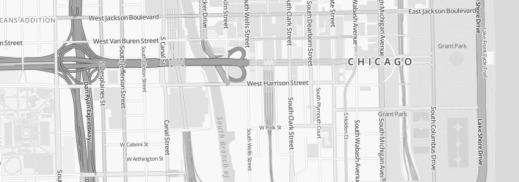

# OSM Bright Greyscale

OSM Bright Greyscale is a greyscale version of the OSM Bright style.

## Installation

### Shapefiles

	./scripts/get-shapefiles.sh

Optionally pass `--dry-run` to not perform anything, merely print out what would be done.

### OpenStreetMap data

Follow [openstreetmap-carto installation instructions](https://github.com/gravitystorm/openstreetmap-carto/blob/master/INSTALL.md#openstreetmap-data)

## Viewing with Kosmtik

Install kosmtik:

	npm install kosmtik

This command displays the map on [http://127.0.0.1:6789/osm-bright/](http://127.0.0.1:6789/osm-bright/)

	./node_modules/kosmtik/index.js serve ./project.mml

### Converting to greyscale

Use the `makebw.pl` script to convert to grey scale:

	for F in *.mss ; do ./makebw.pl <$F | sponge $F ; done
	for F in **/*.svg ; do ./makebw.pl <$F | sponge $F ; done

Convert all images with:

	for F in **/*.png ; do gm mogrify -colorspace gray $F ; done

## History

This style was originally developed by [Mapbox](https://github.com/mapbox/osm-bright) between 2012 → 2016.

In late 2021, [Geofabrik](https://www.geofabrik.de/) patched it to simplify the installation, and make it work with the latest [openstreetmap-carto database](https://github.com/gravitystorm/openstreetmap-carto) installed with [osm2pgsql](https://osm2pgsql.org/).

In 2023, Geofabrik created this style based on the latest [`osm-bright` style](https://github.com/geofabrik/osm-bright).

This style is no longer being actively maintained.

See [LICENSE.txt](./LICENSE.txt) for copyright licence.
